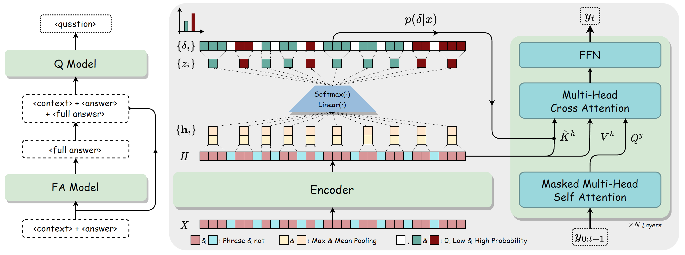

# Improving Question Generation with Multi-level Content Planning

[](https://github.com/zjukg/KnowPAT/main/LICENSE)
[](https://pytorch.org/)

Code and data of EMNLP'2023 Findings: [*Improving Question Generation with Multi-level Content Planning*](https://arxiv.org/abs/2310.13512).

> Previous studies have suggested that key phrase selection is essential for question generation (QG), yet it is still challenging to connect such disjointed phrases into meaningful questions, particularly for long context. To mitigate this issue, we propose MultiFactor, a novel QG framework based on multi-level content planning. Specifically, MultiFactor includes two components: FA-Model, which simultaneously selects key phrases and generates full answers, and Q-Model which takes the generated full answer as an additional input to generate questions. Here, full answer generation is introduced to connect the short answer with the selected key phrases, thus forming an answer-aware summary to facilitate QG. Both FA-Model and Q-Model are formalized as simple-yet-effective Phrase-Enhanced Transformers, our joint model for phrase selection and text generation. 

## 🌈 1. Model Architecture


<!-- ## 🔬 2. Reimplementation -->
## 🔬 2. Dependencies
Install necessary packages:
```shell
pip install -r requirements.txt
```
Before you run our code, please read these implementation and evaluation details.

1. We implement our modeling `${ProjHome}/src/MultiFactor/modeling_bridget5.py` by inheriting from `modeling_t5.py` in Transformers 4.20.1.
    -   If raise any errors when using Huggingface Generator of higher version with our modeling file, please inhert the error functions of  [generation/utils.py](https://github.com/huggingface/transformers/blob/main/src/transformers/generation/utils.py) in `${ProjHome}/src/MultiFactor/modeling_bridget5.py`. We also provide a demo in `modeling_bridget5.py`.
2. We recommend the transformers version is lower than 4.30 although the T5-family tokenizers' [issue](https://github.com/huggingface/transformers/pull/24622).

3. We evulated the BLEU socre using NLTK in `${ProjHome}/src/MultiFactor/multi_factor_trainer.py` instead of [sacreBLEU](https://github.com/mjpost/sacrebleu) for two reasons:
   1. In practice, the difference between the results of sacreBLEU and NLTK are around $0.1$.
   2. Following the previous works.
3. METEOR score will fluctuate wildly if using different packages. Please read [nltk/issues](https://github.com/nltk/nltk/issues/2655) for details. Here, we use the `meteor` api in [pycocoevalcap](https://github.com/salaniz/pycocoevalcap).
4. Different version of [BERTScore](https://github.com/Tiiiger/bert_score) will also influence the final score hugly, our version is 0.3.10.
5. We provide a evaluate script demo in `${ProjHome}/evaluate.py`


## 💻 3. Data Preparation

### 🔧 3.1 Preprocess Dataset
Because it is a cumbersome step, we provide a `demo.json` based on CQG *dev.json* [1] directly, which has included the *pseudo-gold full answer* constucted mentioned in our paper.

Our implementation reads json files instead of jsonl. And the schema is:

```json
{
   "context": "the given input context",
   "answer": "the given answer",
   "question": "the corresponding question",
   "p_phrase": "the postive phrases in the given context",
   "n_phrase": "the negative phrases",
   "full answer": "pseudo-gold full answer (q + a -> a declarative sentence) ",
}
```

We provide four datasets mentioned in our paper huggingface dataset link:

| dataset name              | dataset link                                                          |
|---------------------------|-----------------------------------------------------------------------|
| HotpotQA-Supporting Facts | https://huggingface.co/datasets/zeaver/multifactor_hotpotqa_suppfacts |
| HotpotQA-Full Document    | coming soon                                                           |
| SQuAD 1.1 - Zhou split    | https://huggingface.co/datasets/zeaver/multifactor_squad1.1_zhou      |
| SQuAD 1.1 - Du split      | coming soon                                                           |

When using your custom dataset, please make sure that `p/n_phrase` are in your `context`.

### 🔨3.2 Prepare dataset.pt File
We read raw dataset json file `${ProjHome}\dataset\${dataset_name}\${split}.json`, and generate corresponding `.pt` in `${ProjHome}\dataset\${dataset_name}\${data_foramt}\${split}.pt`. If the dataset input contains the full answers from outside (like inference, not the GOLD-FULL-ANSWER!!), the full answer json file path is `${ProjHome}\dataset\${dataset_name}\${data_foramt}\${split}.json`.

```shell
python ${ProjHome}/src/MultiFactor/multi_factor_dataset.py \ 
    -d ${dataset_name} \ 
    -j ${data_format} \
    -l ${max_length}
```

## 📕 4. Training & Test
1. Initialize default config in  `${ProjHome}/src/config.ini`. You can edit:
   1. Base model path (Please init the "T5" or "MixQG" model path here)
   2. Output path
   3. batch size
   4. and all parameters shown in `{ProjHome}/src/MultiFactor/arguments.py` and `{ProjHome}/src/run.py`.
2. running the command:
```shell
CUDA_VISIBLE_DEVICES=0
python \
  ${ProjHome}/src/run.py \
   -c ${ProjHome}/src/config.ini \
   -j ${dataset_name} \
   -f ${data_foramt} \
    --seed ${seed} \
    --model_type ${model_type} \
    --cls_loss_weight 1.0 \
    --learning_rate 1e-4 \
    --num_train_epochs 10 \
    --num_beams 1 \
    --hard_flag 2 \
    --save_model_pt True
```

## 📚 5. Document
### 📖 5.1 Model Config:
Source code: `${ProjHome}/src/MultiFactor/multi_factor_config.py`

-  **model_type** (str, defaults to "Baseline"): "baseline, "nodel_cls, "MultiFactor".
-  **cls_loss_weight** (float, defaults to 1.0): The weight of the phrase classification auxiliary task during training.
-  **if_cross_enhanced_k** (bool, defaults to False):  Indicates whether the phrase-selection probability project layer is used in the cross-attention module.
-  **hard_flag** (int, 0~3, default to 2): Determines whether the input to $W^{\delta}$ is soft or hard. It is represented as a binary number, where "1" means "hard". The first digit represents training, and the second digit represents inference. The possible values are:
   - 0 ("00"): Link the phrase classifier output and $W^{\delta}$, in which case the gradient will be broadcasted from $W^{\delta}$ to the phrase classifier.
   - 2 ("10"): Use hard labels during training and soft probabilities during inference, proposed as *MultiFactor*.
   - 3 ("11"): hard training and hard inference, or the *One-hot PET-Q model*.
-  We still provide some parameters for other explorations like:
   - **full_answer_decoder** (bool, defaults to False): Enables multi-task generation.
   - **model_freeze** (bool, defaults to False): Enables training the model with a freeze policy (requires modifying the Trainer in `${ProjHome}/src/MultiFactor/multi_factor_trainer.py`).

### 📑 5.2 Data Format:
Source code: `${ProjHome}/src/MultiFactor/multi_factor_dataset.py`

-  **data_name** (str, choices in "cqg", "pcqg" and "squad_1.1_zhou"): dataset name, here we conduct experiments on "cqg" (HotpotQA-Supporting Facts setting [1, 2]), "pcqg"  (passage-level cqg, HotpotQA-Full Docs setting [3]), and "squad_1.1_zhou" (SQuQA1.1-Zhou_splits [4, 5]).
-  **max_length** (int, default to 256): input sequence max length, we set default value $256$. In sentence-level QG task: *pcqg* (passage-level cqg), we set it as $512$.
-  **data_format** (str): control the input and output format. Details are in the table below

| Name                    | Input                                                                      | Infer fa |
|-------------------------|----------------------------------------------------------------------------|:--------:|
| multi_factor            | f"{ANS_SEP} {answer} {FULL_ANS_SEP} {fa} {CONTEXT_SEP}   {context}"        |    Yes   |
| top1_q_model            | f"{ANS_SEP} {answer} {FULL_ANS_SEP} {fa} {CONTEXT_SEP}   {context}"        |    Yes   |
| multi_factor_mixqg      | f"{answer} //n {FULL_ANS_SEP} {fa} {CONTEXT_SEP} {context}"                |    Yes   |
| top1_q_model_mixqg      | f"{answer} //n {FULL_ANS_SEP} {fa} {CONTEXT_SEP} {context}"                |    Yes   |
| mix_full_answer         | f"{ANS_SEP} {answer} {FULL_ANS_SEP} {fa_string} {CONTEXT_SEP}   {context}" |    Yes   |
| \*fa_model              | f"{ANS_SEP} {answer} {CONTEXT_SEP} {context}"                              |    No    |
| q_model_upper           | f"{ANS_SEP} {answer} {FULL_ANS_SEP} {fa} {CONTEXT_SEP}   {context}"        |    No    |
| pet                     | f"{ANS_SEP} {answer} {CONTEXT_SEP} {context}"                              |    No    |
| pet_mixqg               | f"{answer} //n {CONTEXT_SEP} {context}"                                    |    No    |
| full2question_converter | f"{ANS_SEP} {_answer} {FULL_ANS_SEP} {fa}"                                 |    No    |

Where:
- **fa** is the abbreviation of "full answer".
- **fa_string** means concates all the candidates full answer.
- **\*** indicates that fa_model's output is gold full answer.
- **Infer fa**: if yes, there must be a extra (inference full answer) json files (`${ProjHome}\dataset\${dataset_name}\${data_foramt}\${split}.json`).

### 🔍 5.3 Demostration

Here we show the demo to conduct experiments on HotpotQA-Supporting Facts.
1. Put the raw dataset (contains the *pseudo-gold full answer*) in `${ProjHome}\dataset\cqg`
2. Train the *FA_Model*:
```shell
python ${ProjHome}/src/MultiFactor/multi_factor_dataset.py \ 
    -d cqg \ 
    -j fa_model \
    -l 256
```
3. Conduct *FA_Model* inference on train, dev and test splits. And put them as `${ProjHome}\dataset\cqg\multi_factor\${split}.json`

4. Prepare MultiFactor and ablation study `dataset.pt`.
```shell
python ${ProjHome}/src/MultiFactor/multi_factor_dataset.py \ 
    -d cqg \ 
    -j multi_factor \
    -l 256
python ${ProjHome}/src/MultiFactor/multi_factor_dataset.py \ 
    -d cqg \ 
    -j pet \
    -l 256
```
5. Train MultiFactor.
```shell
CUDA_VISIBLE_DEVICES=0
dataset_name=cqg
seed=42
model_type=multifactor
data_foramt=multi_factor
python \
  ${ProjHome}/src/run.py \
  -c ${ProjHome}/src/config.ini \
  -j ${dataset_name} \
  	-f ${data_foramt} \
    --seed ${seed} \
    --model_type ${model_type} \
    --cls_loss_weight 1.0 \
    --learning_rate 1e-4 \
    --num_train_epochs 10 \
    --num_beams 1 \
    --hard_flag 2 \
    --save_model_pt True
```

6. Run other experiments, we list these key arguments as follows:
```shell
# baseline
data_foramt=pet
model_type=baseline

# Cls+Gen, only add a phrase classification auxiliary task
data_foramt=pet
model_type=node_cls

# PET
data_foramt=pet
model_type=multifactor

# One-hot PET
data_foramt=pet
model_type=multifactor
hard_flag=3

# change base model like mixqg-base, add another command line
--train_model_name_or_path Salesforce/mixqg-base
```

## 🤝 Cite:
Please consider citing this paper if you use the code from our work.
Thanks a lot :)

```bigquery
@article{DBLP:journals/corr/abs-2310-13512,
  author       = {Zehua Xia and
                  Qi Gou and
                  Bowen Yu and
                  Haiyang Yu and
                  Fei Huang and
                  Yongbin Li and
                  Cam{-}Tu Nguyen},
  title        = {Improving Question Generation with Multi-level Content Planning},
  journal      = {CoRR},
  volume       = {abs/2310.13512},
  year         = {2023},
  url          = {https://doi.org/10.48550/arXiv.2310.13512},
  doi          = {10.48550/ARXIV.2310.13512}
}

```

## ✏️ Reference
[1] Yang, Zhilin, et al. [HotpotQA: A Dataset for Diverse, Explainable Multi-hop Question Answering](https://arxiv.org/abs/1809.09600). EMNLP, 2018.

[2] Fei, Zichu, et al. [CQG: A Simple and Effective Controlled Generation Framework for Multi-Hop Question Generation](https://aclanthology.org/2022.acl-long.475/). ACL, 2022.

[3] Su, Dan, et al. [QA4QG: Using Question Answering to Constrain Multi-Hop Question Generation](https://arxiv.org/abs/2202.06538). ICASSP, 2023.

[4] Rajpurkar, Pranav, et al. [SQuAD: 100,000+ Questions for Machine Comprehension of Text](https://aclanthology.org/D16-1264/). EMNLP, 2016.

[5] Zhou, Qingyu, et al. [Neural Question Generation from Text: A Preliminary Study](https://arxiv.org/abs/1704.01792). EMNLP, 2017.


